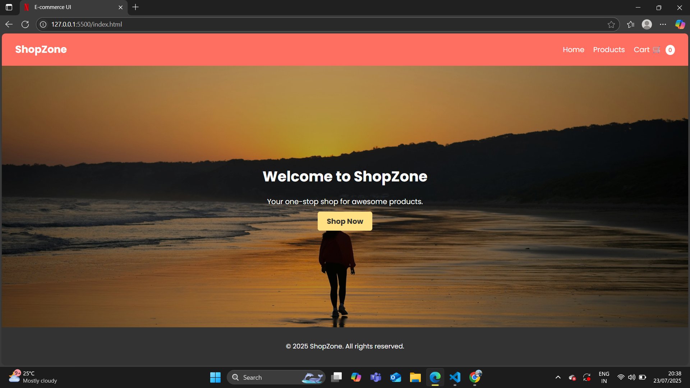
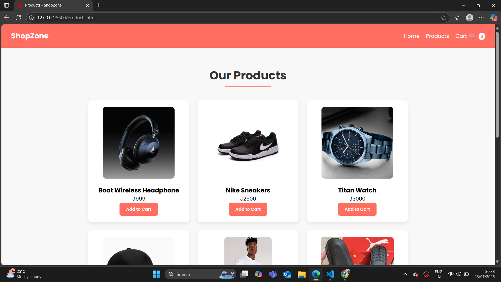
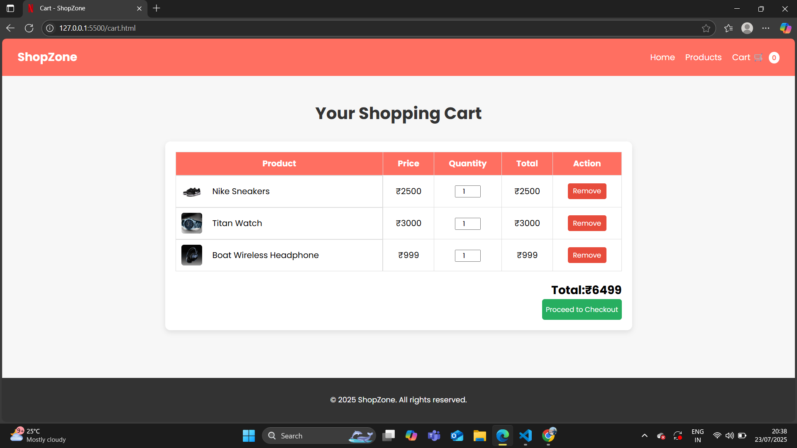

# 🛍 ShopZone - E-commerce UI

A responsive **multi-page E-commerce website** built using **HTML, CSS, and JavaScript**.  
Features include product listings, cart functionality with localStorage, and a responsive navigation bar.

---

## 🚀 Live Demo
[Live Demo Link](https://your-live-link-here.netlify.app/)  

---

## 📸 Screenshots

### Home Page

### Product Page

### Cart Page

---

## 🔥 Features
- **Responsive Navbar** with Hamburger menu.
- **Product Page** with Add-to-Cart functionality.
- **Cart Page** with:
  - Quantity update.
  - Remove item feature.
  - Auto total price calculation.
- **LocalStorage** to persist cart items.
- Fully **responsive design** for mobile, tablet, and desktop.

---

## 🛠 Project Structure
ShopZone/
│
├── index.html # Home Page
├── products.html # Products Page
├── cart.html # Cart Page
├── style.css # Styles
├── index.js # Navbar toggle
├── products.js # Add-to-cart logic
├── cart.js # Cart functionality
└── images/ # Product & Banner images

---

## 📚 Future Updates
- Add a **Checkout Page**.
- Integrate **Payment Gateway** (like Razorpay).
- Fetch products from an API (dynamic product loading).

---

## 👨‍💻 Author
**Jaskaran Singh**  
- GitHub: [@jaskaransingh2121](https://github.com/jaskaransingh2121)  
- Email: jaskaran2127@gmail.com  

---
